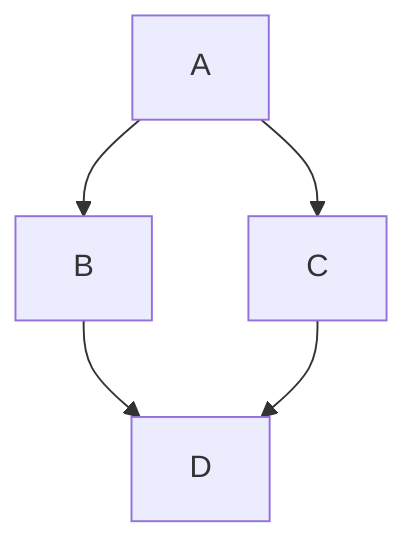
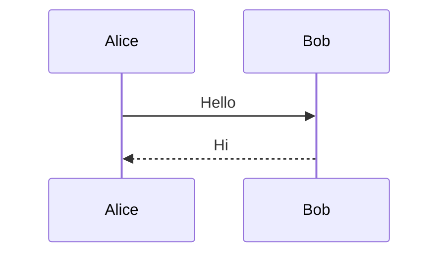
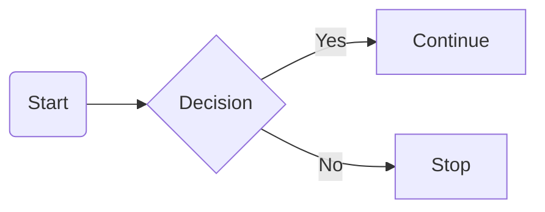

# Markdown Test Suite

> A complete Markdown testing document for Markdown → HTML converters.

---

# Table of Contents

- [Headings](#headings)
- [Text Formatting](#text-formatting)
- [Lists](#lists)
- [Tables](#tables)
- [Code](#code)
- [Images](#images)
- [Video](#video)
- [Audio](#audio)
- [PDF](#pdf)
- [HTML](#html)
- [Math](#math)
- [Mermaid](#mermaid)
- [Everything Else](#everything-else)

---

# Headings

# H1

## H2

### H3

#### H4

##### H5

###### H6

---

# Text Formatting

Normal text.

**Bold**

_Italic_

**_Bold + Italic_**

~~Strikethrough~~

<u>Underline (HTML)</u>

==Highlighted==

`Inline Code`

> Quote

> > Nested Quote

---

# Horizontal Rule

---

---

---

---

# Lists

## Unordered

- Apple
- Banana
- Orange
  - Small
  - Medium
  - Large

## Ordered

1. First
2. Second
3. Third

## Mixed

1. Item
   - Child
     - Child Child

---

# Task Lists

- [x] Completed
- [x] Another
- [ ] Pending
- [ ] Testing

---

# Links

Inline:

[Google](https://google.com)

Auto Link:

https://github.com

Email:

<example@example.com>

---

# Images

## Normal Image


## Image with title


## HTML Image


---

# Video

## HTML Video

<video controls width="500">
    <source src="https://interactive-examples.mdn.mozilla.net/media/cc0-videos/flower.mp4" type="video/mp4">
</video>

---

## Embedded YouTube

<iframe
width="560"
height="315"
src="https://www.youtube.com/embed/dQw4w9WgXcQ"
allowfullscreen>
</iframe>

---

# Audio

<audio controls>
    <source src="https://www.soundhelix.com/examples/mp3/SoundHelix-Song-1.mp3" type="audio/mpeg">
</audio>

---

# PDF

<iframe
src="https://www.w3.org/WAI/ER/tests/xhtml/testfiles/resources/pdf/dummy.pdf"
width="100%"
height="600">
</iframe>

---

# Tables

| Name  | Age | Country |
| ----- | --: | ------- |
| John  |  20 | USA     |
| Sarah |  25 | Canada  |
| Ali   |  30 | Egypt   |

---

## Complex Table

| Left | Center | Right |
| :--- | :----: | ----: |
| A    |   B    |     C |
| D    |   E    |     F |
| G    |   H    |     I |

---

# Code

## Inline

Use `npm install`

---

## C++

```cpp
#include <iostream>

int main() {
    std::cout << "Hello";
}
```

---

## Python

```python
def hello():
    print("Hello World")
```

---

## JavaScript

```javascript
const app = () => {
  console.log("Hello");
};
```

---

## Bash

```bash
npm install
npm run dev
git status
```

---

## JSON

```json
{
  "name": "Markdown",
  "version": 1
}
```

---

## YAML

```yaml
name: Test
version: 1
author: John
```

---

## HTML

```html
<div class="card">Hello</div>
```

---

## CSS

```css
body {
  background: #111;
}
```

---

# HTML

<div style="padding:20px;border:1px solid gray;border-radius:10px">

<h3>HTML Card</h3>

<p>This is embedded HTML.</p>

<button>Click Me</button>

</div>

---

# Details

<details>

<summary>Click to Expand</summary>

Hidden Content

- Item 1
- Item 2

</details>

---

# Emoji

😀 😎 🚀 ❤️ 🎉

:smile:

---

# Keyboard

Press <kbd>Ctrl</kbd> + <kbd>C</kbd>

---

# Footnote

Markdown Footnote.[^1]

[^1]: This is a footnote.

---

# Definition List

Markdown
: A lightweight markup language.

HTML
: HyperText Markup Language.

---

# Escaping

\*Not Bold\*

\# Not Heading

\`Code\`

---

# Subscript / Superscript

H<sub>2</sub>O

x<sup>2</sup>

---

# Abbreviation

The HTML specification.

\*[HTML]: Hyper Text Markup Language

---

# Math

Inline:

$E = mc^2$

Block:

$$
\int_a^b x^2 dx
$$

---

# Mermaid



---

# Sequence Diagram



---

# Flowchart



---

# Blockquote

> Level 1
>
> > Level 2
> >
> > > Level 3

---

# Nested List

- A
  - B
    - C
      - D

---

# Mixed Content

## Project Card

### GymFlow

**Tech Stack**

- Python
- SQLite
- CustomTkinter

Repository:

https://github.com

Image:


```python
print("GymFlow")
```

| Feature  | Status |
| -------- | ------ |
| Members  | ✅     |
| Plans    | ✅     |
| Payments | 🚧     |

---

# Anchor Test

Jump to:

[Go to Math](#math)

[Go to Images](#images)

[Go to Mermaid](#mermaid)

---

# GitHub Alerts

> [!NOTE]
> This is a note.

> [!TIP]
> Helpful information.

> [!IMPORTANT]
> Important information.

> [!WARNING]
> Warning message.

> [!CAUTION]
> Dangerous action.

---

# HTML Form

<form>

<label>Name</label><br>

<input type="text">

<br><br>

<label>Password</label><br>

<input type="password">

<br><br>

<button>Submit</button>

</form>

---

# SVG

<svg width="120" height="120">

<circle
cx="60"
cy="60"
r="50"
fill="red"
/>

</svg>

---

# Collapsible HTML

<details open>

<summary>Always Open</summary>

Content Here

</details>

---

# Unicode

こんにちは

مرحبا

Привет

你好

😀❤️🚀

---

# End

Everything above is intentionally included to stress-test a Markdown renderer.
